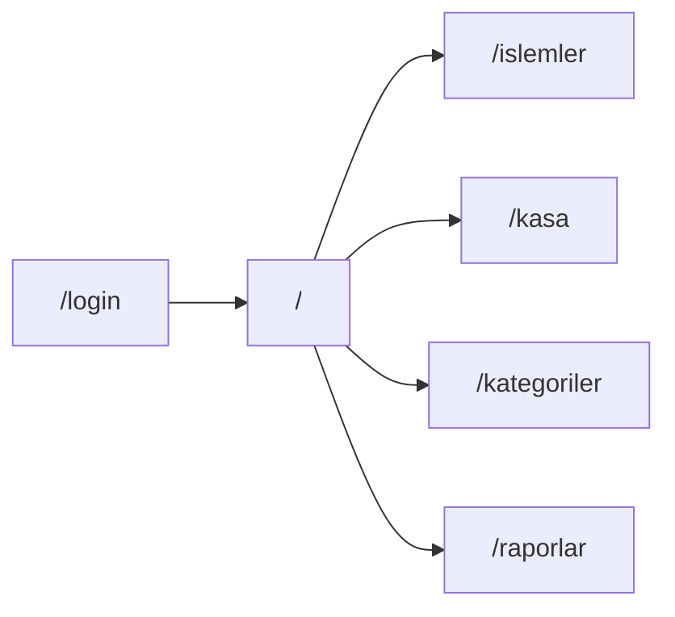

# Kasa Takip MVP — Frontend Planı

## Kapsam

- **Dahil:** Dashboard, Gelir/Gider, Kasa açılış–kapanış, Kategoriler, basit Raporlar, görsel login (auth yok)
- **Hariç:** Gerçek API/auth, stok, personel, şube, cari
- **Dil:** Türkçe UI
- **Veri:** `lib/mock/` altında statik + client state (localStorage ile oturum/kasa günü hissi)

## Tasarım sistemi

Palette (ekran görüntüsü) → Tailwind v4 CSS tokens in [`app/globals.css`](app/globals.css):

| Token | Hex | Kullanım |
|-------|-----|----------|
| `forest` | `#045131` | Primary text, sidebar, güçlü CTA |
| `olive` | `#537528` | Secondary / hover |
| `apple` | `#8BBC15` | Primary accent, active states |
| `lime` | `#A2DC18` | Highlights, success soft |
| `cream` | `#FFF6E5` | Page background, surfaces |
| `surface` | `#FFFFFF` | Cards |
| `muted` | soft gray-green | Borders, secondary text |

- Dark mode yok (scaffold’taki `prefers-color-scheme` kaldırılacak)
- Tipografi: `DM Sans` (UI) + `Fraunces` veya `Source Serif 4` (sadece marka/logo) — Geist yerine; sayısal tutarlar için `tabular-nums`
- Spacing/radius tutarlı scale; radius ~`rounded-xl` (aşırı pill yok)

## Klasör yapısı

```
app/
  (auth)/login/page.tsx
  (app)/layout.tsx          # sidebar + topbar shell
  (app)/page.tsx            # Dashboard
  (app)/islemler/page.tsx
  (app)/kasa/page.tsx
  (app)/kategoriler/page.tsx
  (app)/raporlar/page.tsx
components/
  ui/                       # Button, Input, Select, Card, Modal, Badge, ...
  layout/                   # AppSidebar, AppHeader, PageHeader
  domain/                   # TransactionForm, CashSessionCard, StatCard, ...
lib/
  mock/                     # transactions, categories, cashSession, reports
  types/                    # shared TS types
  utils/                    # cn(), formatMoney(), formatDate()
```

## UI bileşenleri (tekrar yok)

Hepsi `components/ui/` — variant/size props, `cn()` ile birleşik class:

- **Button** — `primary | secondary | ghost | danger`, `sm | md | lg`
- **Input, Textarea, Select, Label, FormField**
- **Card** — `Card`, `CardHeader`, `CardTitle`, `CardContent`
- **Modal** — overlay + panel; confirm için `ConfirmDialog`
- **Badge** — gelir / gider / açık / kapalı
- **DataTable** — columns config, empty state, responsive (mobilde kart listesine düşebilir)
- **Tabs, EmptyState, Spinner, Alert**
- **StatCard** — dashboard KPI

Layout: `AppSidebar` (nav), `AppHeader` (işletme adı, kasa durumu chip), `PageHeader` (başlık + aksiyon slot).

## Ekranlar



1. **Login (`/login`)** — marka + e-posta/şifre alanları + “Giriş yap”; submit → `localStorage` flag + `/` redirect. Guard: `(app)/layout` client check, yoksa login’e.
2. **Dashboard** — bugünkü gelir/gider/net, kasa durumu, son işlemler tablosu, hızlı “Gelir ekle / Gider ekle”.
3. **İşlemler** — filtre (tip, kategori, tarih), DataTable, Modal ile ekle/düzenle/sil (mock state).
4. **Kasa** — açılış bakiyesi, açık gün özeti, kapanış formu (sayım, fark), geçmiş oturumlar listesi.
5. **Kategoriler** — gelir/gider kategorileri CRUD (modal + tablo).
6. **Raporlar** — gün/hafta/ay özet kartları + basit bar/liste (CSS/HTML, chart lib yok veya tek hafif SVG).

## State yaklaşımı (backend öncesi)

- `lib/mock/data.ts` seed
- Client: React context veya basit hooks (`useTransactions`, `useCashSession`) — memory + `localStorage` persist
- Para formatı: `tr-TR` / TRY (`formatMoney`)

## Uygulama sırası

1. Theme + fonts + `cn` + types + mock data  
2. `components/ui/*` primitives  
3. App shell (sidebar/header) + login  
4. Dashboard → İşlemler → Kasa → Kategoriler → Raporlar  
5. Boş/yükleme/hata durumları ve mobil düzen

## Bilinçli kararlar

- shadcn/Radix yok — Tailwind v4 + kendi bileşenler (hafif, tam kontrol)
- Icon: `lucide-react` (tek bağımlılık)
- Route groups: `(auth)` vs `(app)` — farklı layout
- Metadata: “Kasa” / kasa takip açıklaması; `lang="tr"`
